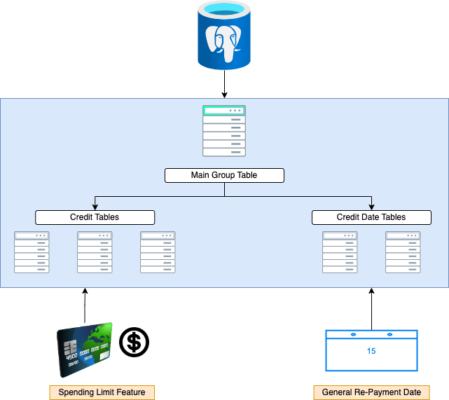

# Increase Credit Score
## <ins> Introduction

The Starter Pack will 
contain an Inventory Management System, and Register Checkout System. 
The Inventory Management System can be used to keep a track of how much items we have of a 
certain product as well as add/remove items from the inventory. An interesting feature of this system is 
that it will automatically update the list to provide the latest data with every customer transaction, so you would know 
at any given time if any items are running out of stock. Moreover, the Register Checkout System will assist with finding 
the total cost of all the items in a customer’s cart, including taxes. 

The `Increase Credit Score` tool was designed by me as a Proof-Of-Concept (POC) project to help users manage their credit spending 
and re-payment structure to effectively increase their credit score in the long run. The tool comprises of two major components 

__Targeted User:__ The product will be used by my Supermarket Business, this product will help facilitate our current business processes to make day to day operations more efficient so that more time can be spent on helping and developing relationships with customers. 

__Technologies:__
>  Git | Python | Unit Testing | PostgreSQL 

## <ins> Design
### Project Architecture

#### Register Checkout System
The Register Checkout System will assist with finding the total cost of all the items in a customer’s cart, including taxes.

| Functions | Description |
|-----------|-------------|
| `name`    | Description |
| `name`    | Description |

#### Inventory Management System
The Inventory Management System can be used to keep a track of how much items we have of a certain product as well as add/remove items from the inventory.

| Functions | Description |
|-----------|-------------|
| `name`    | Description |
| `name`    | Description |

## <ins> Product Usage

## <ins> Testing

#### Register Checkout System

#### Inventory Management System

## <ins> Improvements

